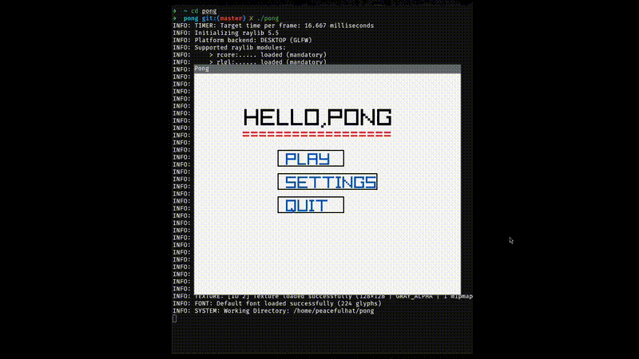

# Pong

A simple Pong game written in C using Raylib.
##### Note
under development , not formated well.

## Features
- Classic Pong gameplay with simple controls.
- Uses the Raylib library for graphics.
- Written in pure C for performance and simplicity.

## Installation

### Arch Linux
Install Raylib using:
```
sudo pacman -S raylib
```
### Ubuntu/Debian
```
sudo apt update
sudo apt install libraylib-dev
```

### Fedora
```
sudo dnf install raylib-devel
```
### openSuSE
```
sudo zypper install raylib-devel
```
### other Distributions
```
git clone https://github.com/raysan5/raylib.git
cd raylib/src
make PLATFORM=PLATFORM_DESKTOP
sudo make install
```
### Building The Game
```
git clone https://github.com/your-username/pong.git
cd pong
```
**run** ./build.sh && ./pong

### Demo Gif


